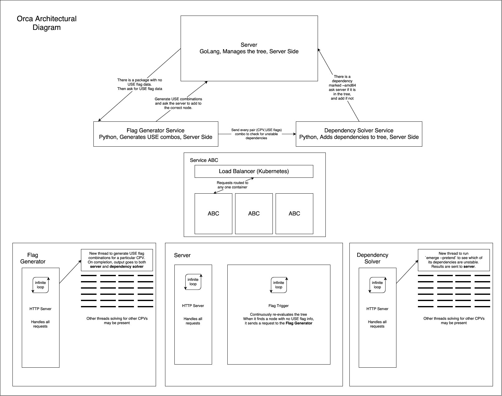

# Google Summer Of Code '16
[](https://gitter.im/pallavagarwal07/SummerOfCode16?utm_source=badge&utm_medium=badge&utm_campaign=pr-badge&utm_content=badge)

**ALL the commits in this repository, as well as all the pushes to the
following docker repositories was done as a part of Google Summer of Code
2016**
- https://hub.docker.com/r/pallavagarwal07/gentoo-stabilization/
- https://hub.docker.com/r/pallavagarwal07/testimages/

## Goal
Gentoo is an operating system with extreme focus on configurability and
performance.  To provide fully customizable experience, without interfering
with the stability of the system, Gentoo has a concept of masked packages.
These masked packages (or versions) are either untested, or are known to be
unstable and are installed only if the user explicitly unmasks them. While this
concept is a boon to the stability of the operating system, the current
implementation requires the packages to be tested manually by a team of
developers. This significantly increases the time in which new packages are
made safely available to the users. The goal of this project is to provide a
mechanism to test and stabilize the packages automatically with little or no
human intervention.

## Result
During this project, I built Orca, a continuous build and stabilization engine
that automatically tries to find out the packages with broken dependencies, or
code. Not just that, it is possible for any user to install the stabilization
client to help in the stabilization process, and all the result of the
stabilization calls is stored at a single place on the server.

## Usage:
### TL;DR
You can help in the stabilization of Gentoo packages by downloading the file
`wrapper.sh` from the repository, and running it. Please note that you need
docker installed to use the stabilization container.

If you are on Gentoo Operating system, you can use the ebuild in the folder
`utilities/ebuilds/`. This ebuild will be added to the Gentoo Portage tree as
soon as the backward incompatible changes to the server are done, since the
ebuild may not be fit to use just now.

## Repository Structure
```
├── Containers
│   ├── Dockerfile-(Client,Server,Solver)
│   ├── etc_portage
│   │   └── .................. :: Contents for /etc/portage in container
│   ├── Orca-Deployment.yml
│   ├── scripts
│   │   ├── ControlContainer
│   │   │   └── .............. :: Client container files
│   │   ├── FlagGenerator
│   │   │   └── .............. :: Flag, Dep Solver container files
│   │   └── Server
│   │       └── .............. :: Server (graph container) files
│   └── wrapper.sh ........... :: WRAPPER script for client (symlinked)
├── Documents
│   └── ...................... :: Proposal, arch diagrams, minutes of meeting
├── utilities
│   ├── addAll.sh
│   ├── bugzillaRESTapi
│   │   ├── bug_file.py
│   │   └── bugzilla.py
│   ├── ebuilds .............. :: Ebuilds of client for Gentoo users
│   │   └── orca_ci-0.1.ebuild
│   ├── kubeUtils.sh
│   └── packages
├── LICENSE
└── README.md
```

## Methodology
Oftentimes it is valuable to know if a package is failing to build, even if the
exact reason for the failure is not know. The whole of Orca is built on this
mindset, with the main task of indicating an error if it exists instead of
trying to figure out why it exists.

Orca consists of two parts. The server and the client. Both play a really
important role in the stabilization process.

### Server:
The server is responsible of maintaining a database of all the packages that
have to be or have been stabilized. But it isn't enough to just have all the
packages in a dump. A package cannot be stabilized until all its dependencies
have been stabilized.

To get around this problem, the server maintains a tree type structure of all
packages. Obviously, the dependencies occur as children in the tree. Doing this
isn't as easy at it seems, because packages often have circular dependencies.
While the server, to function properly needs a Directed Acyclic Graph. Consider
the following:

```

                                    A
                                  /   \
                                 ↙     ↘
                                B       C
                               / \
                              ↙   ↘
                             D     C
                            /
                           ↙
                          A
```

There are two repetitions in the above graph, `A` and `C`. However `C` doesn't
actually give us any trouble. Because the tree still remains acyclic (since it
is directed). However, the chain `A->B->D->A` forms a directed cycle. To
resolve such cycles, the server replace one of the nodes with a new "fake"
node. This makes the above tree.

```

                                    A
                                  /   \
                                 ↙     ↘
                                B       C
                               / \
                              ↙   ↘
                             D     C
                            /
                           ↙
                          A*
```

This again makes the graph acyclic. Starred nodes are assumed to be stable
(i.e.  the fake nodes, not the top level `A` node) and are never sent for
stabilization.

In the resulting graph, the server looks for a leaf node, and sends it for
stabilization.

## USE flags and combinations
Find the main article [HERE](https://www.varstack.com/2016/05/13/SAT-Solver/)

Gentoo Packages are not all built with the same settings, and the users have
the ability to customize their build with a variety of USE flags (like on-off
switches for various features). This gives the users unparalleled control, and
is one of the most inviting features of the Gentoo Operating System.

However, the USE flags also make it very difficult to test the packages of
bugs, because for `n` USE flags, there are literally `2^n` different ways to
build the package. The server takes a shortcut, and builds each package with at
most 4 different combinations of USE flags.

1. Min number of USE flags possible
2. Max number of USE flags possible
3. Random combination not present in above two
4. Random combination not present in above three

Some of the USE flag combinations given by the above rules may not be legal.
For example, if an ebuild specifies `REQUIRED_USE="^^ (a b c)"` then EXACTLY
one flag out of `a`, `b`, and `c` should be enabled. This doesn't fall under
"without USE flags" or "with all USE flags" category.

So, the server instead of choosing the flags randomly, also needs to calculate
the flag combinations that are legal for that package. Server does this by
modelling the `REQUIRED_USE` constraint as a boolean satisfiability problem.
After solving the satisfiability problem with a SAT solver, it finds
combinations that are allowed by the ebuild to prevent errors due to this
cause.

## Server Architecture
The server uses Kubernetes for orchestration. The server runs three primary
containers. The "Server", "Flag Generator" and "Dependency Solver". There is
also a mongoDB container which stores all of the information for the dependency
graph.

A Kubernetes Service surrounds each of "Flag Generator" and "Dependency Solver"
which means that multiple containers of each can hide behind those services and
a load balancer would distribute the incoming requests to the containers.



## Stabilization procedure
When a client runs the wrapper script for stabilization, the client spawns a
docker container with a minimal gentoo system. The system requests a package
name from the server. When faced with this request, server evaluates the DAG
of the packages and returns a leaf node.

Note that every package node has multiple USE flag combinations set in. The
server selects one, and sends the data to the client. The client sets portage
settings to those USE flags and runs the merge of that package. The client
merge stops in case of any errors, or continues till the build is over in case
there aren't any. After the build, all the logs, as well as the build output is
tarred, and uploaded to the server.

For the upload request, server generates a time limited upload token for the
openstack storage, and gives it to the client. Once the logs are uploaded, the
server marks the package in the tree STABLE/UNSTABLE, depending on what was
reported.


## Scope and future work
Work on this project is far from over. The server currently can help stabilize
packages based on USE flags only. There are a lot more variables involved when
working with Gentoo. Things like architecture, python_targets, ruby_targets can
still cause unforeseen problems, and the task is to modify the server to make
the testing generic, irrespective of what the factors of testing be.

## Thanks
I have no words that can describe how grateful I am to my mentors - [Sebastien
Fabbro](https://wiki.gentoo.org/wiki/User:Bicatali) and [Nitin
Agarwal](https://plus.google.com/u/0/+NitinAgarwal3006/about) - for all their
support, for being extremely responsive and helpful with every one of my
problems. Without their vote of confidence, this project would've been a lot
harder and a lot less fun to do.

I would be lucky to get to work with them further as I continue work on this
project and try to get it accepted as an official Gentoo Project.

I am also thankful to Gentoo Organisation for the opprtunity to work on this project,
which helped me learn a lot in such a short period.
